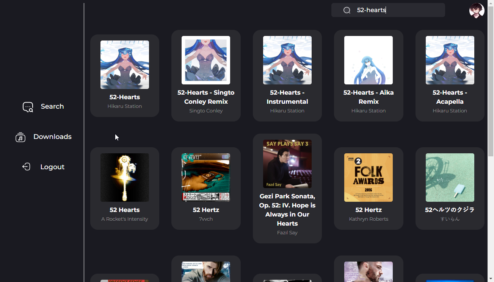
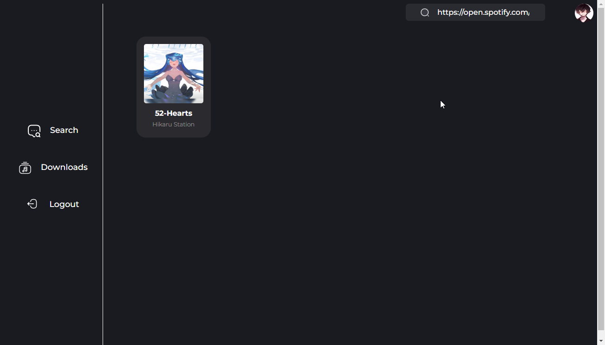
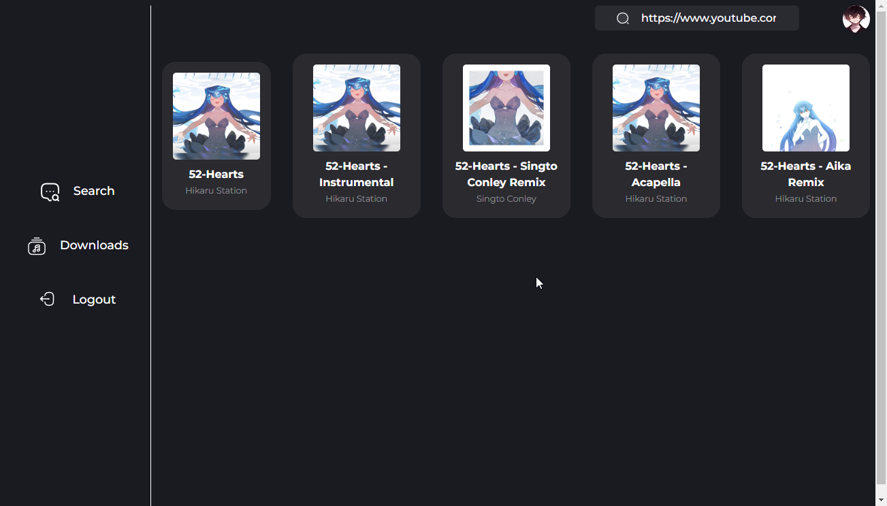
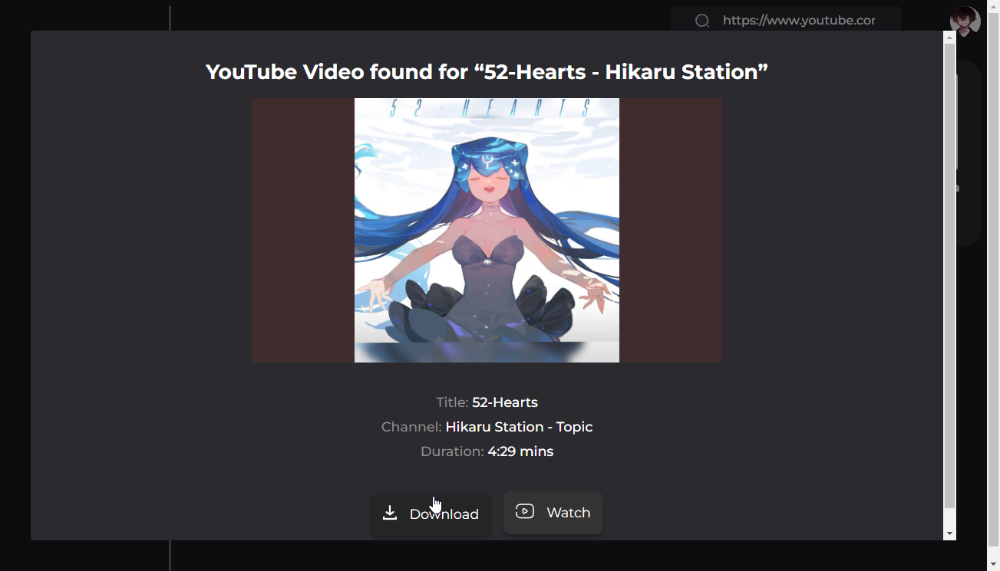
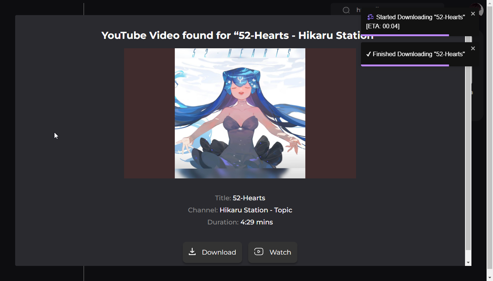
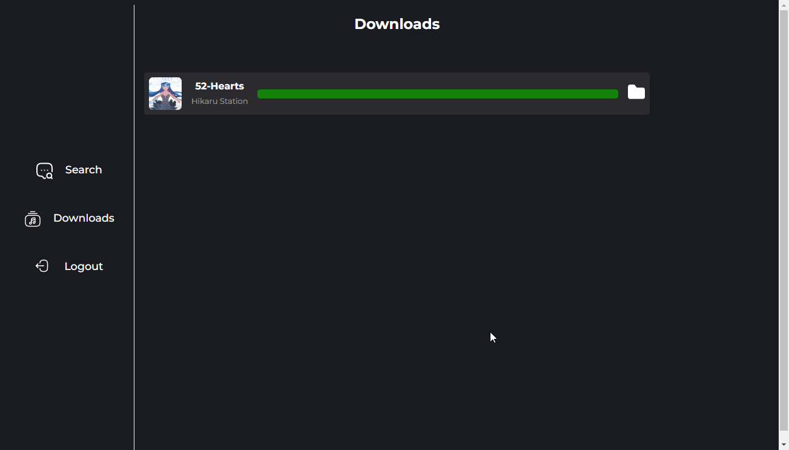

<h1 align="center">
	
        <p>Spotii-Chan</p>
</h1>

<h3 align="center">
	Download Spotify Songs from YouTube in one Click
</h3>
<p align="center">
	<strong>
		<a href="https://github.com/yashraj-n/Spotii-Chan/releases">Releases</a>
	
</p>
<p align="center">


</p>

<p align="center">
	
</p>

## Overview

- **Download Spotify Songs**. Search the desired song on Spotii-Chan and download it in one click.

- **Uses Invidious**. Spotii-Chan uses [Invidious](https://invidious.io/) to download the songs from YouTube.

- **No Ads**. Spotii-Chan is completely ad-free.

- **Reverse Song Lookup**. Spotii-Chan can use download songs from YouTube URL or Spotify URI.

- **Open Source**. Spotii-Chan is completely open source made in Tauri and written in Rust.

Scroll to the bottom for more screenshots.

## Installation and usage

Head over to the [releases](https://github.com/yashraj-n/Spotii-Chan/releases) page and download the latest version for your operating system.

## Building from source

Spotii-Chan is written in Rust and uses Tauri to create a native application.

You need to have Rust and Node.js installed on your system to build Spotii-Chan.

```bash
# Clone the repository
git clone https://github.com/yashraj-n/Spotii-Chan/ 

# Change directory
cd Spotii-Chan

# Install dependencies
yarn

# Run the application
yarn tauri dev

# Build the application
yarn tauri build

```

This is created using create-tauri-app with [Next.js template](https://tauri.app/v1/guides/getting-started/setup/next-js/)

> ⚠️ As a Rust beginner, I'm sure there are a lot of mistakes in the code. Please feel free to open an issue or a PR if you find any. There are occurence of `unwrap()` and `expect()` in the code which I will remove in the future.

## Screenshots

Search for a song.
<p align="center">
    

<br>
Search Song from Spotify URL/URI.
<p align="center">
    

<br>
Search the song using the YouTube URL.
<p align="center">
    

<br>
Download the song.
<p align="center">
    

<p align="center">
    

Downloads
<p align="center">
    

## License
[MIT](./LICENSE)

